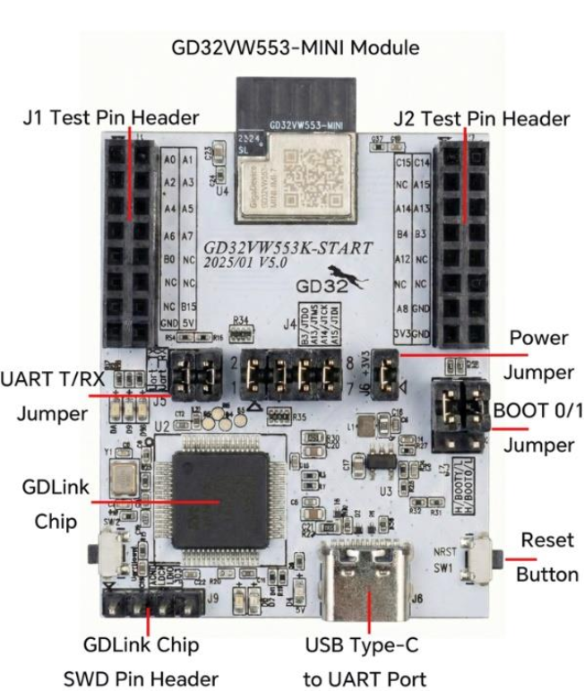

.. zephyr:board:: gd32vw553k_start

Overview
********

The GigaDevice GD32VW553K-START is the evaluation board for the
GD32VW553KMQ7: a RISC-V (Nuclei N307, ``rv32imafc``/``ilp32f``, 160 MHz)
microcontroller with 2.4 GHz Wi-Fi 6 (802.11ax, 1x1) and Bluetooth LE 5.3
radios, 4 MB flash and 320 KB SRAM.

   The GD32VW553K-START, carrying the GD32VW553-MINI module.

Features
========

- GD32VW553-MINI module with the GD32VW553KMQ7 (QFN32, 4096 KB flash,
  320 KB SRAM) and a PCB antenna
- On-board GD-Link probe: JTAG plus a USB CDC virtual COM port, both over
  the single USB Type-C connector
- Two test pin headers (J1, J2) breaking out the GPIOs
- BOOT0/BOOT1 jumpers, a power jumper and a reset button (NRST)
- Three user LEDs on GPIOC (no user button)

Hardware
********

- Nuclei N307 core @ 160 MHz (HXTAL 40 MHz -> PLLDIG), I-cache 32 KB,
  single-precision FPU (``double`` is emulated -- prefer ``float`` in hot
  paths).  ``CONFIG_FPU=y`` is enabled board-wide: the prebuilt radio
  libraries require the ``ilp32f`` ABI.
- ECLIC interrupt controller (116 sources, 4 level bits) and the Nuclei
  64-bit SysTimer as the Zephyr system clock (160 MHz)
- 4 MB flash at ``0x08000000`` (usable application area: 3948 KB)
- 288 KB SRAM available to Zephyr: the chip mask ROM owns the first
  ``0x200`` bytes (RAM starts at ``0x20000200``) and the top 32 KB are
  shared with the Wi-Fi MAC RX buffers
- Wi-Fi 6 MAC/PHY and BLE 5.3 controller with RF shared between both
  radios (coexistence arbitrated inside the prebuilt libraries)

Supported Features
==================

.. zephyr:board-supported-hw::

Peripheral status on this port:

+----------------+------------------------------------+------------------------+
| Peripheral     | Driver (compatible)                | Status                 |
+================+====================================+========================+
| UART           | ``gd,gd32-usart``                  | validated (console)    |
+----------------+------------------------------------+------------------------+
| GPIO           | ``gd,gd32-gpio``                   | validated (LEDs)       |
+----------------+------------------------------------+------------------------+
| Pinctrl        | ``gd,gd32-pinctrl-af``             | validated              |
+----------------+------------------------------------+------------------------+
| Entropy (TRNG) | ``gd,gd32-trng``                   | validated (test suite) |
+----------------+------------------------------------+------------------------+
| Watchdog       | ``gd,gd32-fwdgt``                  | wired                  |
+----------------+------------------------------------+------------------------+
| Wi-Fi          | ``gd,gd32vw55x-wifi``              | validated (STA+SoftAP) |
+----------------+------------------------------------+------------------------+
| BLE            | ``gd,gd32vw55x-bt-hci`` (see note) | advertising validated  |
+----------------+------------------------------------+------------------------+
| I2C/SPI/ADC/   | ``gd,gd32-*``                      | wired in DT; pinctrl   |
| PWM/DMA        |                                    | AF table pending       |
+----------------+------------------------------------+------------------------+

Serial Console
==============

The console is UART2 (PA6 TX / PA7 RX), wired to the GD-Link virtual COM
port.  It shows up on the host as ``/dev/ttyACM0`` at 115200 8N1.

.. note::
   The GD-Link *virtual COM port* can wedge after long flash/serial
   sessions -- replug the USB cable if the console goes silent.  JTAG
   keeps working; never soft-reset the probe's USB from the host.

LEDs
====

Three LEDs sit on GPIOC, driven push-pull, active HIGH (vendor SDK names
in parentheses):

====== ==== ============ =========================
LED    Pin  DT alias     Vendor SDK name
====== ==== ============ =========================
LED1   PC0  ``led0``     LED_RUN
LED2   PC1  ``led1``     LED_SLEEP
LED3   PC2  ``led2``     LED_RX
====== ==== ============ =========================

Pin headers
===========

The user I/O of the module is broken out on two 2x8 test-pin headers, J1
and J2 (silkscreen abbreviates the port letter: ``A0`` is PA0).

.. table:: J1 -- user GPIO, +5V and GND

   ======== =================== ======== ===================
   Signal   Function            Signal   Function
   ======== =================== ======== ===================
   PA0      GPIO                PA1      GPIO
   PA2      GPIO                PA3      GPIO
   PA4      GPIO                PA5      GPIO
   PA6      UART2_TX (console)  PA7      UART2_RX (console)
   PB0      GPIO                NC       --
   NC       --                  NC       --
   NC       --                  PB15     GPIO
   GND      ground              +5V      power in/out
   ======== =================== ======== ===================

.. table:: J2 -- user GPIO (shared with JTAG), +3V3 and GND

   ======== =================== ======== ===================
   Signal   Function            Signal   Function
   ======== =================== ======== ===================
   PC15     GPIO                PC14     GPIO
   NC       --                  PA15     JTDI
   PA14     JTCK                PA13     JTMS
   PB4      JNTRST              PB3      JTDO
   PA12     GPIO                NC       --
   NC       --                  NC       --
   PA8      GPIO                GND      ground
   +3V3     3.3V power test     GND      ground
   ======== =================== ======== ===================

.. note::
   PA13/PA14/PA15/PB3/PB4 on J2 are the chip's JTAG pins, wired to the
   on-board GD-Link through the J4 shorting caps.  Use them as plain GPIO
   only after removing those caps, or the debug probe and the application
   will fight over the lines.

Flash layout
============

The application is linked at ``0x08000000``, bypassing the vendor MBL
bootloader.

======================== ============== ====================================
Range                    Size           Purpose
======================== ============== ====================================
0x08000000 - 0x083db000  3948 KiB       Available to the firmware (what the
                                        devicetree ``flash0`` exposes)
0x083db000 - 0x083fb000  128 KiB        Reserved (storage / future use)
0x083fb000 - 0x08400000  20 KiB         **Wi-Fi NVDS** -- do not erase
======================== ============== ====================================

.. warning::
   The **last** pages of the flash are not free: the Wi-Fi NVDS holds the
   RF calibration data, and erasing it breaks the radio.

For reference, image sizes on this port: ``hello_world`` ~20 KiB, the
Wi-Fi shell sample ~620 KiB, Wi-Fi + BLE ~990 KiB (of 3948 KiB).

Radio libraries (west blobs)
============================

The Wi-Fi/BLE stack uses the GigaDevice *WiFi & BLE SDK V1.0.3g* (pinned
commit, ABI-validated): its open sources live in the
``gigadevice_wifi_ble`` west module and the prebuilt radio libraries are
fetched from the official GigaDevice repository -- no binary is carried
in any Zephyr tree:

.. code-block:: console

   west update gigadevice_wifi_ble
   west blobs fetch gigadevice_wifi_ble

Programming and Debugging
*************************

Flashing (drag and drop -- no extra tools)
==========================================

The on-board GD-Link enumerates a USB mass-storage drive (volume label
``Gigadevice``) that programs the target from a copied firmware image -- the
same model as mbed/DAPLink and the Raspberry Pi Pico.  It needs no OpenOCD, no
vendor tool and no host-side runner: just copy the built HEX to the mounted
drive.

.. code-block:: console

   west build -b gd32vw553k_start samples/hello_world
   # copy the image to the GD-Link drive (adjust the mount path for your OS)
   cp build/zephyr/zephyr.hex /media/$USER/Gigadevice/

The GD-Link programs the internal flash (RISC-V, ``0x08000000``, as set in the
drive's ``CONFIG.TXT``) and resets the target automatically.

Flashing and debugging with OpenOCD
===================================

``west flash`` and ``west debug`` (for breakpoints and gdb) use OpenOCD.
The ``gd32vw55x`` NOR flash driver is not yet in mainline / Zephyr-SDK OpenOCD,
so a GigaDevice OpenOCD build that carries it is required. Point the runner at
it with the ``--openocd`` option, or place that OpenOCD first on your ``PATH``.

.. zephyr-app-commands::
   :zephyr-app: samples/hello_world
   :board: gd32vw553k_start
   :goals: build flash
   :flash-args: --openocd /path/to/gigadevice/openocd

Set the flash runner option ``--openocd`` to the path of your GigaDevice
OpenOCD build. The same option is passed to ``west debug``:

.. code-block:: console

   west debug --openocd /path/to/gigadevice/openocd

When the console dies but the target seems alive, attach with gdb instead of
re-flashing: the firmware almost certainly is still running (see the VCP note
above).

Samples validated on this board
*******************************

Basics
======

.. code-block:: console

   # Hello world (console on the GD-Link VCP, 115200)
   west build -p always -b gd32vw553k_start samples/hello_world && west flash

   # Blinky (LED1 = PC0)
   west build -p always -b gd32vw553k_start samples/basic/blinky && west flash

   # Interactive shell
   west build -p always -b gd32vw553k_start samples/subsys/shell/shell_module && west flash

   # Hardware TRNG (test suite passes on target)
   west build -p always -b gd32vw553k_start tests/drivers/entropy/api && west flash

Wi-Fi station + SoftAP (:zephyr:code-sample:`wifi-shell`)
=========================================================

.. code-block:: console

   west build -p always -b gd32vw553k_start samples/net/wifi/shell
   west flash

On the shell::

   uart:~$ wifi scan
   uart:~$ wifi connect -s "<ssid>" -k 1 -p <passphrase>   # WPA2-PSK
   uart:~$ net ping <gateway>                              # DHCP is automatic
   uart:~$ wifi ap enable -s MyAP -k 1 -p 12345678 -c 6    # SoftAP

Enable ``CONFIG_NET_DHCPV4_SERVER=y`` for the SoftAP to hand out
addresses to its clients.  For headless testing (no console) the driver
offers ``CONFIG_WIFI_GDWIFI_TEST_AUTOCONNECT`` with
``CONFIG_WIFI_GDWIFI_TEST_SSID``/``_PSK``.

.. note::
   The station is WPA2-only.  A WPA3-transition network (WPA2/WPA3 mixed
   mode) associates through WPA2-PSK; a WPA3(SAE)-only network is refused
   up front with ``-ENOTSUP`` and a console message naming the unsupported
   AKM, instead of letting the prebuilt supplicant attempt the SAE
   handshake (which faults).

BLE advertising (vendor host) + Wi-Fi coexistence
=================================================

The **public** GigaDevice radio libraries do not expose an HCI transport
(their ``ble_register_hci_uart`` is a stub), so the native Zephyr
Bluetooth host cannot drive the controller; the in-tree ``bt-hci`` driver
is ready for the partner ``libble`` that does.  BLE advertising through
the vendor RivieraWaves host works alongside Wi-Fi:

.. code-block:: console

   west build -p always -b gd32vw553k_start samples/net/wifi/shell -- \
       -DCONFIG_GD32VW55X_BLE_VENDOR=y
   west flash

The device advertises as ``ZephyrGD32`` (see
``CONFIG_GD32VW55X_BLE_VENDOR_NAME``) while the Wi-Fi shell above remains
fully functional -- validated with a sustained 0%-loss ping during
advertising.  Advertising restarts on every disconnection, so the device
stays discoverable across connections.

Port notes
**********

- The radio interrupt sources run at ECLIC level 8 and hardware-preempt
  the kernel sources (level 0); the SoC selects
  ``CLIC_PARAMETER_INTCTLBITS=4`` / ``CLIC_PARAMETER_MNLBITS=4`` to make
  that possible -- do not lower them, the BLE baseband misses its
  half-slot deadlines without interrupt levels.
- Wi-Fi power save is forced OFF by the port (the LPDS wake path is not
  implemented yet); a dozing MAC would go deaf.
- The prebuilt radio libraries ship with the RivieraWaves debug asserts
  compiled in, and a blob-internal race trips one of them
  (``mm_task.c:2411``, MAC config vs HW state) on roughly 1 in 5
  back-to-back connects.  The port routes the blob assert handler to its
  own (``gdwifi_glue.c``), which logs and continues past this known-benign
  assert -- release RivieraWaves behavior; validated with 10/10 stress
  connect cycles at 0% packet loss.  Any other blob assert remains fatal.
- The OS facade of the radio libraries (``sys_*``) maps onto native
  Zephyr primitives (``k_thread``/``k_msgq``/``k_sem``/``k_work``); the
  IP stack is the native Zephyr one (the SDK lwIP is not compiled).
