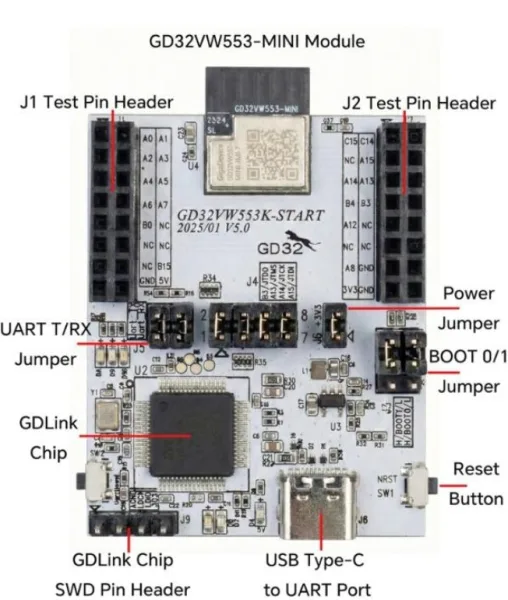

.. zephyr:board:: gd32vw553k_start

Overview
********

The GD32VW553K-START is the GigaDevice evaluation board for the GD32VW553KMQ7, a RISC-V
microcontroller (Nuclei N307, ``rv32imafc``, 160 MHz) with 4 MB of flash, 320 KB of SRAM and an
integrated 2.4 GHz Wi-Fi 6 (802.11ax, 1x1) and Bluetooth LE 5.2 radio. The MCU sits on the
GD32VW553-MINI module with a PCB antenna; the base board adds a GD-Link debug probe, a USB Type-C
connector, three user LEDs and two pin headers.

   The GD32VW553K-START, carrying the GD32VW553-MINI module.

Hardware
********

- GD32VW553KMQ7 (QFN32) on the GD32VW553-MINI module, with a PCB antenna
- Nuclei N307 core at 160 MHz (40 MHz HXTAL through the PLL), 32 KB instruction cache,
  single-precision FPU, ECLIC interrupt controller and the 64-bit Nuclei system timer
- 4 MB of internal flash at ``0x08000000``
- 320 KB of SRAM, of which 288 KB are available to the application: the mask ROM keeps the first
  ``0x200`` bytes and the top 32 KB are shared with the Wi-Fi MAC receive buffers
- Wi-Fi 6 MAC/PHY and Bluetooth LE 5.2 controller with a shared RF front end
- On-board GD-Link probe: JTAG and a USB CDC virtual COM port over the USB Type-C connector
- Two 2x8 pin headers (J1, J2) breaking out the GPIOs
- BOOT0/BOOT1 jumpers, a power jumper, the J5 jumpers that route the console UART to the
  GD-Link virtual COM port, and a reset button (NRST); there is no user button
- Three user LEDs on GPIOC

For more information about the GD32VW553 SoC and the board:

- `GD32VW553 series product page`_
- `GD32VW55x Wi-Fi/BLE SDK`_ (documents, radio libraries and examples)

Supported Features
==================

.. zephyr:board-supported-hw::

The board enables ``CONFIG_FPU`` by default: the prebuilt radio libraries are built for the
``ilp32f`` ABI, and every image that links them needs the FPU.

The RTC runs from the internal 32 kHz RC oscillator (``clock-source = "irc32k"`` in the SoC
devicetree), since the board has no 32.768 kHz crystal (PC14/PC15 are routed to the J2 header).
Expect it to drift, and resynchronize it from the network when accuracy matters.

The free watchdog is the ``watchdog0`` alias. The window watchdog (``wwdgt``) is left disabled;
enable it and point the alias at it to use it instead.

Connections and IOs
===================

Serial console
--------------

The console is UART2 (PA6 TX, PA7 RX), routed to the GD-Link virtual COM port through the J5
jumpers. It shows up on the host as a USB CDC ACM port (``/dev/ttyACM0`` on Linux) at 115200 8N1.

LEDs
----

The three LEDs are driven push-pull, active high:

====== ===== ====== ============
LED    Pin   Color  DT alias
====== ===== ====== ============
LED1   PB0   red    ``led0``
LED2   PA12  green  ``led1``
LED3   PB4   blue   ``led2``
====== ===== ====== ============

The three pins are also broken out on the J1 and J2 headers. PB4 comes out of reset as JNTRST
with its pull-up enabled, so the blue LED is lit until the pin is configured as an output, and
an analog signal on PB0 is loaded by the red LED.

Pin headers
-----------

The user I/O of the module is broken out on two 2x8 headers, J1 and J2. The tables follow the
silkscreen of the board revision V5.0 (2025/01), where ``A0`` stands for PA0.

.. table:: J1: user GPIO, +5V and GND

   ======== =================== ======== ===================
   Signal   Function            Signal   Function
   ======== =================== ======== ===================
   PA0      GPIO                PA1      GPIO
   PA2      GPIO                PA3      GPIO
   PA4      GPIO                PA5      GPIO
   PA6      UART2_TX (console)  PA7      UART2_RX (console)
   PB0      GPIO                NC       --
   NC       --                  NC       --
   NC       --                  PB15     GPIO
   GND      ground              +5V      power in/out
   ======== =================== ======== ===================

.. table:: J2: user GPIO (shared with JTAG), +3V3 and GND

   ======== =================== ======== ===================
   Signal   Function            Signal   Function
   ======== =================== ======== ===================
   PC15     GPIO                PC14     GPIO
   NC       --                  PA15     JTDI
   PA14     JTCK                PA13     JTMS
   PB4      JNTRST              PB3      JTDO
   PA12     GPIO                NC       --
   NC       --                  NC       --
   PA8      GPIO                GND      ground
   +3V3     3.3 V               GND      ground
   ======== =================== ======== ===================

.. note::
   PA13, PA14, PA15, PB3 and PB4 on J2 are the JTAG pins. The four J4 shorting caps wire JTMS,
   JTCK, JTDI and JTDO to the on-board GD-Link: remove them to use those pins as plain GPIO or
   to attach an external probe, or the GD-Link and the other user will fight over the lines.

Flash layout
============

The application is linked at ``0x08000000`` and runs without the vendor MBL bootloader. The
board devicetree partitions the 4 MB of flash (4 KB pages) for MCUboot, with
``zephyr,code-partition`` pointing at ``slot0_partition``:

======================== ========= ================================================
Range                    Size      Partition
======================== ========= ================================================
0x08000000 - 0x08020000  128 KiB   ``boot_partition`` (mcuboot)
0x08020000 - 0x08040000  128 KiB   ``storage_partition``
0x08040000 - 0x0820e000  1848 KiB  ``slot0_partition`` (image-0)
0x0820e000 - 0x083dc000  1848 KiB  ``slot1_partition`` (image-1)
0x083dc000 - 0x083fb000  124 KiB   ``scratch_partition`` (image-scratch)
0x083fb000 - 0x08400000  20 KiB    ``nvds_partition``: Wi-Fi NVDS, do not erase
======================== ========= ================================================

Without MCUboot the application ignores the partitions and is linked at the start of the
flash. With ``west build --sysbuild`` and ``SB_CONFIG_BOOTLOADER_MCUBOOT=y`` the application
is linked into ``slot0_partition`` and MCUboot into ``boot_partition``; each slot has 462
pages, so MCUboot needs ``CONFIG_BOOT_MAX_IMG_SECTORS=512``. MCUboot serial recovery over the
console UART (``zephyr,uart-mcumgr = &uart2`` in the MCUboot overlay) has been validated
with ``mcumgr``: image upload, test, swap through the scratch partition and revert.

.. warning::
   The last 20 KiB of the flash hold the NVDS of the radio firmware, RF calibration data
   included. Erasing them breaks the radio; keep them out of any partition you write to.

Wi-Fi and Bluetooth LE
======================

The radio runs the GigaDevice *WiFi & BLE SDK* V1.0.3g. Its sources are part of the
``hal_gigadevice`` module (``gd32vw55x/wifi_ble_sdk``) and the prebuilt radio libraries are
fetched from the GigaDevice repository as binary blobs; no binary is carried in a Zephyr tree:

.. code-block:: console

   west update hal_gigadevice
   west blobs fetch hal_gigadevice

Without the blobs the board still builds every sample that does not enable ``CONFIG_WIFI``.

The Wi-Fi driver provides a station and a SoftAP interface through the native networking stack.
The station supports WPA2-PSK; a WPA3-only (SAE) network is refused with ``-ENOTSUP``, since the
prebuilt supplicant does not complete the SAE handshake. Wi-Fi power save is kept off. The SDK
stack does its AES and SHA in software, so the CAU and HAU engines stay with the Zephyr crypto
drivers and are free for the application.

The public radio libraries do not expose an HCI transport, so the Zephyr Bluetooth host cannot
drive the controller yet; the ``bt-hci`` node is in place for a firmware build that does.
Bluetooth LE advertising and connections are available through the vendor host with
``CONFIG_WIFI_GDWIFI_BLE_VENDOR=y``, and work while Wi-Fi is connected.

The radio interrupts run at ECLIC level 8 and preempt the kernel interrupts (level 0); the SoC
sets ``CLIC_PARAMETER_INTCTLBITS`` and ``CLIC_PARAMETER_MNLBITS`` to 4 for that, and the BLE
baseband misses its half-slot deadlines with fewer level bits.

Power management
================

With ``CONFIG_PM=y`` the kernel idles in the ``suspend-to-idle`` state, which is the PMU
deep-sleep: the core clocks stop, SRAM and the peripheral registers are kept, and the RTC keeps
running. The wake-up timer of the RTC is loaded with the time to the next kernel timeout (up to
32 s per sleep), and the time spent asleep is measured on the RTC calendar and credited to the
system timer, so uptime stays right. The RTC alarms and any pin with an EXTI interrupt wake the
SoC as well, the console RX pin included (the byte that wakes it is lost).

The debug module does not answer while the SoC is in deep-sleep, so the GD-Link cannot attach to
or flash a sleeping board: hold the reset button until ``west flash`` connects, and keep the
application awake for a few seconds after boot during development.

Programming and Debugging
*************************

.. zephyr:board-supported-runners::

Flashing
========

``west flash`` uses OpenOCD through the on-board GD-Link. The ``gd32vw55x`` flash driver is not
in mainline OpenOCD or in the Zephyr SDK yet, so the `Nuclei OpenOCD`_ build that carries it is
required. Point the runner at it with the ``--openocd`` option:

.. zephyr-app-commands::
   :zephyr-app: samples/hello_world
   :board: gd32vw553k_start
   :goals: build flash
   :flash-args: --openocd /path/to/nuclei/openocd

The Zephyr SDK pins its own OpenOCD in the build, so the ``PATH`` does not matter. To drop the
option, record that OpenOCD in the build instead, for every build of the workspace:

.. code-block:: console

   west config build.cmake-args -- "-DOPENOCD=/path/to/nuclei/bin/openocd \
     -DOPENOCD_DEFAULT_PATH=/path/to/nuclei/share/openocd/scripts"

An external SEGGER J-Link needs no OpenOCD: the J-Link software carries the GD32VW553 flash loader
since V7.92l. Remove the four J4 shorting caps, wire the J-Link to the J2 JTAG pins (VTref to
+3V3, TMS to PA13, TCK to PA14, TDI to PA15, TDO to PB3, GND, optionally nTRST to PB4) and select
the ``jlink`` runner:

.. zephyr-app-commands::
   :zephyr-app: samples/hello_world
   :board: gd32vw553k_start
   :goals: build flash
   :flash-args: --runner jlink

The GD-Link also enumerates a USB mass-storage drive (volume label ``Gigadevice``) that programs
the internal flash from a copied image and resets the target, with no host-side tool:

.. code-block:: console

   west build -b gd32vw553k_start samples/hello_world
   cp build/zephyr/zephyr.hex /media/$USER/Gigadevice/

Open the console at 115200 8N1 to see the output:

.. code-block:: console

   Hello World! gd32vw553k_start/gd32vw553

.. note::
   The GD-Link virtual COM port can stop working after long flash and serial sessions. Replug the
   USB cable if the console goes silent; the firmware is still running and JTAG keeps working.

Debugging
=========

``west debug`` goes through the same OpenOCD build, with the same ``--openocd`` option, or
through the J-Link GDB server with ``--runner jlink``:

.. zephyr-app-commands::
   :zephyr-app: samples/hello_world
   :board: gd32vw553k_start
   :goals: debug
   :flash-args: --openocd /path/to/nuclei/openocd

Wi-Fi shell
===========

The :zephyr:code-sample:`wifi-shell` sample exercises the station and the SoftAP:

.. zephyr-app-commands::
   :zephyr-app: samples/net/wifi/shell
   :board: gd32vw553k_start
   :goals: build flash
   :compact:

.. code-block:: console

   uart:~$ wifi scan
   uart:~$ wifi connect -s "<ssid>" -k 1 -p <passphrase>
   uart:~$ net ping <gateway>
   uart:~$ wifi ap enable -s MyAP -k 1 -p 12345678 -c 6

DHCP runs automatically on the station. Enable ``CONFIG_NET_DHCPV4_SERVER=y`` for the SoftAP to
hand out addresses to its clients. Build with ``-DCONFIG_WIFI_GDWIFI_BLE_VENDOR=y`` to advertise
over Bluetooth LE at the same time.

References
**********

.. target-notes::

.. _GD32VW553 series product page:
   https://www.gigadevice.com/product/mcu/wireless-mcus/gd32vw553-series

.. _GD32VW55x Wi-Fi/BLE SDK:
   https://github.com/GigaDevice-GD32-MCU/GD32VW55x_WiFi_BLE_SDK

.. _Nuclei OpenOCD:
   https://github.com/riscv-mcu/riscv-openocd
